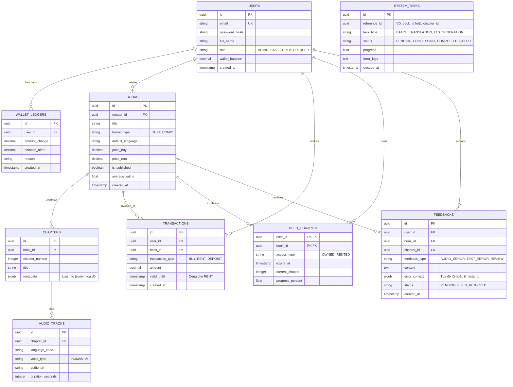

# THIẾT KẾ CƠ SỞ DỮ LIỆU REVABOOK (DATABASE ARCHITECTURE)

## 1. Yêu cầu & Quyết định Kỹ thuật (Tech Stack & Constraints)

- **Hệ quản trị CSDL (RDBMS):** **PostgreSQL 15+**. Lý do: Hỗ trợ tính toàn vẹn dữ liệu (ACID) cực tốt cho giao dịch tài chính (mua/thuê), hỗ trợ kiểu `JSONB` mạnh mẽ (phù hợp lưu trữ metadata linh hoạt của sách đa ngôn ngữ trước khi cần dùng đến MongoDB), khả năng mở rộng tốt và hỗ trợ Full-text search tích hợp.
- **Mức độ chuẩn hóa (Normalization):** Chuẩn hóa mức 3 (3NF) để giảm thiểu dư thừa dữ liệu (Data Redundancy), nhưng sẽ chủ động phi chuẩn hóa (Denormalization) một vài trường hợp (như lưu tổng số rating `average_rating` ở bảng Book) để tối ưu hiệu suất đọc (Read-heavy application).
- **Quy ước đặt tên (Naming Convention):** `snake_case` cho tất cả các bảng và cột. Khóa chính luôn là `id` (UUID hoặc BIGSERIAL). Khóa ngoại là `tên_bảng_số_ít_id` (ví dụ: `user_id`).

## 2. Sơ đồ Thực thể Liên kết (ERD - Entity Relationship Diagram)



## 3. SQL DDL (Data Definition Language)

Dưới đây là mã SQL để khởi tạo các cấu trúc bảng cốt lõi trong PostgreSQL:

```sql
-- Kích hoạt extension sinh UUID
CREATE EXTENSION IF NOT EXISTS "uuid-ossp";

-- 1. Bảng USERS
CREATE TABLE users (
    id UUID PRIMARY KEY DEFAULT uuid_generate_v4(),
    email VARCHAR(255) UNIQUE NOT NULL,
    password_hash VARCHAR(255) NOT NULL,
    full_name VARCHAR(100) NOT NULL,
    role VARCHAR(20) NOT NULL DEFAULT 'USER', -- 'ADMIN', 'STAFF', 'CREATOR', 'USER'
    wallet_balance DECIMAL(12, 2) DEFAULT 0.00,
    created_at TIMESTAMP WITH TIME ZONE DEFAULT CURRENT_TIMESTAMP,
    updated_at TIMESTAMP WITH TIME ZONE DEFAULT CURRENT_TIMESTAMP
);

-- Bảng WALLET_LEDGERS (Sổ cái đối soát dòng tiền)
CREATE TABLE wallet_ledgers (
    id UUID PRIMARY KEY DEFAULT uuid_generate_v4(),
    user_id UUID NOT NULL REFERENCES users(id),
    amount_change DECIMAL(12, 2) NOT NULL,
    balance_after DECIMAL(12, 2) NOT NULL,
    reason VARCHAR(255) NOT NULL,
    created_at TIMESTAMP WITH TIME ZONE DEFAULT CURRENT_TIMESTAMP
);

-- 2. Bảng BOOKS
CREATE TABLE books (
    id UUID PRIMARY KEY DEFAULT uuid_generate_v4(),
    creator_id UUID NOT NULL REFERENCES users(id) ON DELETE CASCADE,
    title VARCHAR(255) NOT NULL,
    description TEXT,
    format_type VARCHAR(20) NOT NULL, -- 'TEXT' hoặc 'COMIC'
    default_language VARCHAR(10) DEFAULT 'vi',
    price_buy DECIMAL(10, 2) DEFAULT 0.00,
    price_rent DECIMAL(10, 2) DEFAULT 0.00,
    is_published BOOLEAN DEFAULT FALSE,
    average_rating DECIMAL(3, 2) DEFAULT 0.00,
    created_at TIMESTAMP WITH TIME ZONE DEFAULT CURRENT_TIMESTAMP
);

-- 3. Bảng CHAPTERS
CREATE TABLE chapters (
    id UUID PRIMARY KEY DEFAULT uuid_generate_v4(),
    book_id UUID NOT NULL REFERENCES books(id) ON DELETE CASCADE,
    chapter_number INTEGER NOT NULL,
    title VARCHAR(255) NOT NULL,
    content_text TEXT, -- Cho sách chữ, có thể NULL nếu là comic
    metadata JSONB, -- Lưu trữ tọa độ bong bóng thoại hoặc file json cấu trúc
    created_at TIMESTAMP WITH TIME ZONE DEFAULT CURRENT_TIMESTAMP,
    UNIQUE(book_id, chapter_number)
);

-- 4. Bảng AUDIO_TRACKS (Lưu trữ các phiên bản âm thanh lồng tiếng)
CREATE TABLE audio_tracks (
    id UUID PRIMARY KEY DEFAULT uuid_generate_v4(),
    chapter_id UUID NOT NULL REFERENCES chapters(id) ON DELETE CASCADE,
    language_code VARCHAR(10) NOT NULL, -- 'vi', 'en', 'ja',...
    voice_type VARCHAR(20) NOT NULL, -- 'HUMAN', 'AI'
    audio_url VARCHAR(500) NOT NULL,
    duration_seconds INTEGER,
    created_at TIMESTAMP WITH TIME ZONE DEFAULT CURRENT_TIMESTAMP,
    UNIQUE(chapter_id, language_code) -- Mỗi chương 1 ngôn ngữ chỉ có 1 bản thu chính
);

-- 5. Bảng TRANSACTIONS (Giao dịch tài chính)
CREATE TABLE transactions (
    id UUID PRIMARY KEY DEFAULT uuid_generate_v4(),
    user_id UUID NOT NULL REFERENCES users(id),
    book_id UUID REFERENCES books(id),
    transaction_type VARCHAR(20) NOT NULL, -- 'BUY', 'RENT', 'DEPOSIT'
    amount DECIMAL(12, 2) NOT NULL,
    valid_until TIMESTAMP WITH TIME ZONE, -- Hạn dùng nếu là RENT
    created_at TIMESTAMP WITH TIME ZONE DEFAULT CURRENT_TIMESTAMP
);

-- 6. Bảng USER_LIBRARIES (Thư viện của người dùng - Tiến độ & Quyền truy cập)
CREATE TABLE user_libraries (
    user_id UUID NOT NULL REFERENCES users(id) ON DELETE CASCADE,
    book_id UUID NOT NULL REFERENCES books(id) ON DELETE CASCADE,
    access_type VARCHAR(20) NOT NULL, -- 'OWNED', 'RENTED'
    expire_at TIMESTAMP WITH TIME ZONE, -- Hết hạn nếu là RENTED
    current_chapter INTEGER DEFAULT 1,
    progress_percent DECIMAL(5, 2) DEFAULT 0.00,
    updated_at TIMESTAMP WITH TIME ZONE DEFAULT CURRENT_TIMESTAMP,
    PRIMARY KEY (user_id, book_id)
);

-- 7. Bảng FEEDBACKS (Tương tác & Báo lỗi cho AI Chatbot xử lý)
CREATE TABLE feedbacks (
    id UUID PRIMARY KEY DEFAULT uuid_generate_v4(),
    user_id UUID NOT NULL REFERENCES users(id),
    book_id UUID NOT NULL REFERENCES books(id) ON DELETE CASCADE,
    chapter_id UUID REFERENCES chapters(id),
    feedback_type VARCHAR(30) NOT NULL, -- 'AUDIO_ERROR', 'TEXT_ERROR', 'REVIEW'
    content TEXT NOT NULL,
    error_context JSONB, -- { "timestamp": 12.5, "text_block": "abc", "suggested_fix": "xyz" }
    status VARCHAR(20) DEFAULT 'PENDING', -- 'PENDING', 'FIXED', 'REJECTED'
    created_at TIMESTAMP WITH TIME ZONE DEFAULT CURRENT_TIMESTAMP
);

-- 8. Bảng SYSTEM_TASKS (Theo dõi tiến trình AI bất đồng bộ)
CREATE TABLE system_tasks (
    id UUID PRIMARY KEY DEFAULT uuid_generate_v4(),
    reference_id UUID NOT NULL, -- Tham chiếu tới Book ID hoặc Chapter ID
    task_type VARCHAR(50) NOT NULL, -- VD: 'BATCH_TRANSLATION', 'TTS_GENERATION'
    status VARCHAR(20) DEFAULT 'PENDING', -- 'PENDING', 'PROCESSING', 'COMPLETED', 'FAILED'
    progress DECIMAL(5, 2) DEFAULT 0.00,
    error_logs TEXT,
    created_at TIMESTAMP WITH TIME ZONE DEFAULT CURRENT_TIMESTAMP,
    updated_at TIMESTAMP WITH TIME ZONE DEFAULT CURRENT_TIMESTAMP
);
```

## 4. Chiến lược Tối ưu hóa Chỉ mục (Indexes Strategy)

Vì REVABOOK là nền tảng đọc/nghe nội dung, lượng truy vấn `SELECT` sẽ áp đảo `INSERT/UPDATE`. Do đó, cần đánh các Index chiến lược sau:

```sql
-- Tối ưu tìm kiếm sách theo Creator (Tác giả xem danh sách sách của mình)
CREATE INDEX idx_books_creator ON books(creator_id);

-- Tối ưu lọc sách đang xuất bản để hiển thị trên Store
CREATE INDEX idx_books_published ON books(is_published) WHERE is_published = TRUE;

-- Tối ưu việc load Chapter của một Book cụ thể và đảm bảo sắp xếp đúng
CREATE INDEX idx_chapters_book_number ON chapters(book_id, chapter_number);

-- Tối ưu load Audio theo Chapter và Ngôn ngữ (Phục vụ Smart Player)
CREATE INDEX idx_audio_tracks_chapter_lang ON audio_tracks(chapter_id, language_code);

-- Tối ưu kiểm tra quyền truy cập thư viện của User khi mở sách (Mật độ truy vấn cực cao)
CREATE INDEX idx_user_libraries_user_book ON user_libraries(user_id, book_id);

-- Tối ưu truy vấn lịch sử giao dịch của User
CREATE INDEX idx_transactions_user ON transactions(user_id);

-- Tối ưu lấy danh sách lỗi (Pending) cho Creator Studio / Chatbot
CREATE INDEX idx_feedbacks_book_status ON feedbacks(book_id, status) WHERE status = 'PENDING';
```

## 5. Kiến trúc mở rộng (Data Architecture Notes)

*   **Polyglot Persistence tương lai:** Bảng `chapters` hiện tại đang dùng cột `metadata JSONB` để lưu tọa độ bong bóng thoại. Khi lượng sách lên hàng chục ngàn cuốn, field này sẽ rất lớn. Ở giai đoạn Scale-out (Mở rộng), dữ liệu JSON này sẽ được chuyển sang **MongoDB**, PostgreSQL chỉ giữ lại ID tham chiếu.
*   **Audio Storage:** Cột `audio_url` sẽ chỉ lưu đường dẫn CDN (VD: CloudFront, S3 Bucket link). Không lưu Binary trực tiếp trong DB.
*   **Audit Trail:** Với ứng dụng có ví tiền (Wallet), mọi UPDATE liên quan đến `wallet_balance` cần được trigger lưu vào một bảng `wallet_logs` riêng biệt (Log-append only) để đối soát.