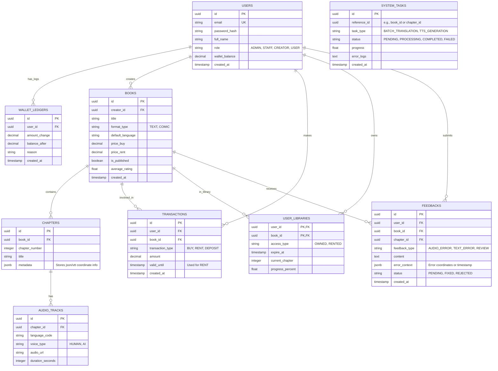

# REVABOOK DATABASE ARCHITECTURE

## 1. Technical Requirements & Decisions (Tech Stack & Constraints)

- **Database Management System (RDBMS):** **PostgreSQL 15+**. Reason: Excellent ACID compliance for financial transactions (buy/rent), strong `JSONB` support (suitable for flexible multi-language metadata before needing MongoDB), great scalability, and integrated Full-text search.
- **Normalization:** 3rd Normal Form (3NF) to minimize Data Redundancy, with selective Denormalization (e.g., storing `average_rating` in the `books` table) to optimize performance for read-heavy operations.
- **Naming Convention:** `snake_case` for all tables and columns. Primary keys are always `id` (UUID or BIGSERIAL). Foreign keys are `singular_table_name_id` (e.g., `user_id`).

## 2. Entity Relationship Diagram (ERD)



## 3. SQL DDL (Data Definition Language)

```sql
-- Enable UUID extension
CREATE EXTENSION IF NOT EXISTS "uuid-ossp";

-- 1. USERS table
CREATE TABLE users (
    id UUID PRIMARY KEY DEFAULT uuid_generate_v4(),
    email VARCHAR(255) UNIQUE NOT NULL,
    password_hash VARCHAR(255) NOT NULL,
    full_name VARCHAR(100) NOT NULL,
    role VARCHAR(20) NOT NULL DEFAULT 'USER', -- 'ADMIN', 'STAFF', 'CREATOR', 'USER'
    wallet_balance DECIMAL(12, 2) DEFAULT 0.00,
    created_at TIMESTAMP WITH TIME ZONE DEFAULT CURRENT_TIMESTAMP,
    updated_at TIMESTAMP WITH TIME ZONE DEFAULT CURRENT_TIMESTAMP
);

-- WALLET_LEDGERS table
CREATE TABLE wallet_ledgers (
    id UUID PRIMARY KEY DEFAULT uuid_generate_v4(),
    user_id UUID NOT NULL REFERENCES users(id),
    amount_change DECIMAL(12, 2) NOT NULL,
    balance_after DECIMAL(12, 2) NOT NULL,
    reason VARCHAR(255) NOT NULL,
    created_at TIMESTAMP WITH TIME ZONE DEFAULT CURRENT_TIMESTAMP
);

-- 2. BOOKS table
CREATE TABLE books (
    id UUID PRIMARY KEY DEFAULT uuid_generate_v4(),
    creator_id UUID NOT NULL REFERENCES users(id) ON DELETE CASCADE,
    title VARCHAR(255) NOT NULL,
    description TEXT,
    format_type VARCHAR(20) NOT NULL, -- 'TEXT' or 'COMIC'
    default_language VARCHAR(10) DEFAULT 'en',
    price_buy DECIMAL(10, 2) DEFAULT 0.00,
    price_rent DECIMAL(10, 2) DEFAULT 0.00,
    is_published BOOLEAN DEFAULT FALSE,
    average_rating DECIMAL(3, 2) DEFAULT 0.00,
    created_at TIMESTAMP WITH TIME ZONE DEFAULT CURRENT_TIMESTAMP
);

-- 3. CHAPTERS table
CREATE TABLE chapters (
    id UUID PRIMARY KEY DEFAULT uuid_generate_v4(),
    book_id UUID NOT NULL REFERENCES books(id) ON DELETE CASCADE,
    chapter_number INTEGER NOT NULL,
    title VARCHAR(255) NOT NULL,
    content_text TEXT, -- For text-based books, NULL if comic
    metadata JSONB, -- Stores speech bubble coordinates or structured JSON
    created_at TIMESTAMP WITH TIME ZONE DEFAULT CURRENT_TIMESTAMP,
    UNIQUE(book_id, chapter_number)
);

-- 4. AUDIO_TRACKS table
CREATE TABLE audio_tracks (
    id UUID PRIMARY KEY DEFAULT uuid_generate_v4(),
    chapter_id UUID NOT NULL REFERENCES chapters(id) ON DELETE CASCADE,
    language_code VARCHAR(10) NOT NULL, -- 'vi', 'en', 'ja',...
    voice_type VARCHAR(20) NOT NULL, -- 'HUMAN', 'AI'
    audio_url VARCHAR(500) NOT NULL,
    duration_seconds INTEGER,
    created_at TIMESTAMP WITH TIME ZONE DEFAULT CURRENT_TIMESTAMP,
    UNIQUE(chapter_id, language_code)
);

-- 5. TRANSACTIONS table
CREATE TABLE transactions (
    id UUID PRIMARY KEY DEFAULT uuid_generate_v4(),
    user_id UUID NOT NULL REFERENCES users(id),
    book_id UUID REFERENCES books(id),
    transaction_type VARCHAR(20) NOT NULL, -- 'BUY', 'RENT', 'DEPOSIT'
    amount DECIMAL(12, 2) NOT NULL,
    valid_until TIMESTAMP WITH TIME ZONE, -- Expiry for RENT
    created_at TIMESTAMP WITH TIME ZONE DEFAULT CURRENT_TIMESTAMP
);

-- 6. USER_LIBRARIES table
CREATE TABLE user_libraries (
    user_id UUID NOT NULL REFERENCES users(id) ON DELETE CASCADE,
    book_id UUID NOT NULL REFERENCES books(id) ON DELETE CASCADE,
    access_type VARCHAR(20) NOT NULL, -- 'OWNED', 'RENTED'
    expire_at TIMESTAMP WITH TIME ZONE, -- Expiry for RENTED
    current_chapter INTEGER DEFAULT 1,
    progress_percent DECIMAL(5, 2) DEFAULT 0.00,
    updated_at TIMESTAMP WITH TIME ZONE DEFAULT CURRENT_TIMESTAMP,
    PRIMARY KEY (user_id, book_id)
);

-- 7. FEEDBACKS table
CREATE TABLE feedbacks (
    id UUID PRIMARY KEY DEFAULT uuid_generate_v4(),
    user_id UUID NOT NULL REFERENCES users(id),
    book_id UUID NOT NULL REFERENCES books(id) ON DELETE CASCADE,
    chapter_id UUID REFERENCES chapters(id),
    feedback_type VARCHAR(30) NOT NULL, -- 'AUDIO_ERROR', 'TEXT_ERROR', 'REVIEW'
    content TEXT NOT NULL,
    error_context JSONB, -- { "timestamp": 12.5, "text_block": "abc", "suggested_fix": "xyz" }
    status VARCHAR(20) DEFAULT 'PENDING', -- 'PENDING', 'FIXED', 'REJECTED'
    created_at TIMESTAMP WITH TIME ZONE DEFAULT CURRENT_TIMESTAMP
);

-- 8. SYSTEM_TASKS table
CREATE TABLE system_tasks (
    id UUID PRIMARY KEY DEFAULT uuid_generate_v4(),
    reference_id UUID NOT NULL, -- Refers to Book ID or Chapter ID
    task_type VARCHAR(50) NOT NULL, -- e.g., 'BATCH_TRANSLATION', 'TTS_GENERATION'
    status VARCHAR(20) DEFAULT 'PENDING', -- 'PENDING', 'PROCESSING', 'COMPLETED', 'FAILED'
    progress DECIMAL(5, 2) DEFAULT 0.00,
    error_logs TEXT,
    created_at TIMESTAMP WITH TIME ZONE DEFAULT CURRENT_TIMESTAMP,
    updated_at TIMESTAMP WITH TIME ZONE DEFAULT CURRENT_TIMESTAMP
);
```

## 4. Index Optimization Strategy

```sql
-- Optimize book search by Creator
CREATE INDEX idx_books_creator ON books(creator_id);

-- Optimize published book filtering for Store
CREATE INDEX idx_books_published ON books(is_published) WHERE is_published = TRUE;

-- Optimize Chapter loading for a specific Book
CREATE INDEX idx_chapters_book_number ON chapters(book_id, chapter_number);

-- Optimize Audio loading by Chapter and Language
CREATE INDEX idx_audio_tracks_chapter_lang ON audio_tracks(chapter_id, language_code);

-- Optimize library access check (High frequency)
CREATE INDEX idx_user_libraries_user_book ON user_libraries(user_id, book_id);

-- Optimize transaction history lookup
CREATE INDEX idx_transactions_user ON transactions(user_id);

-- Optimize error list retrieval (Pending) for Creator Studio
CREATE INDEX idx_feedbacks_book_status ON feedbacks(book_id, status) WHERE status = 'PENDING';
```

## 5. Scalability Notes

*   **Polyglot Persistence:** Move `metadata JSONB` in `chapters` to **MongoDB** when scaling up.
*   **Audio Storage:** `audio_url` points to CDN/S3.
*   **Audit Trail:** `wallet_ledgers` acts as an append-only log for all balance changes.
