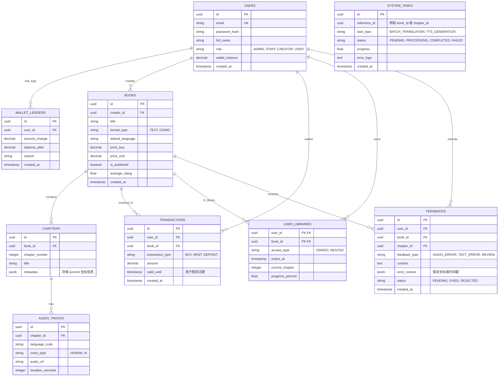

# REVABOOK 数据库架构设计 (DATABASE ARCHITECTURE)

## 1. 技术要求与决策 (Tech Stack & Constraints)

- **数据库管理系统 (RDBMS):** **PostgreSQL 15+**。理由：对金融交易（购买/租赁）具有极佳的 ACID 合规性；强大的 `JSONB` 支持（适合在切换到 MongoDB 前存储灵活的多语言元数据）；良好的扩展性和集成的全文检索功能。
- **规范化 (Normalization):** 遵循第三范式 (3NF) 以减少数据冗余，并对特定场景进行反规范化（例如在 `books` 表中存储 `average_rating`）以优化高频读取性能。
- **命名规范 (Naming Convention):** 所有表名和列名均使用 `snake_case`。主键始终为 `id` (UUID 或 BIGSERIAL)。外键命名为 `单数表名_id` (例如：`user_id`)。

## 2. 实体关系图 (ERD)



## 3. SQL DDL (数据定义语言)

```sql
-- 启用 UUID 扩展
CREATE EXTENSION IF NOT EXISTS "uuid-ossp";

-- 1. 用户表 (USERS)
CREATE TABLE users (
    id UUID PRIMARY KEY DEFAULT uuid_generate_v4(),
    email VARCHAR(255) UNIQUE NOT NULL,
    password_hash VARCHAR(255) NOT NULL,
    full_name VARCHAR(100) NOT NULL,
    role VARCHAR(20) NOT NULL DEFAULT 'USER', -- 'ADMIN', 'STAFF', 'CREATOR', 'USER'
    wallet_balance DECIMAL(12, 2) DEFAULT 0.00,
    created_at TIMESTAMP WITH TIME ZONE DEFAULT CURRENT_TIMESTAMP,
    updated_at TIMESTAMP WITH TIME ZONE DEFAULT CURRENT_TIMESTAMP
);

-- 钱包流水表 (WALLET_LEDGERS)
CREATE TABLE wallet_ledgers (
    id UUID PRIMARY KEY DEFAULT uuid_generate_v4(),
    user_id UUID NOT NULL REFERENCES users(id),
    amount_change DECIMAL(12, 2) NOT NULL,
    balance_after DECIMAL(12, 2) NOT NULL,
    reason VARCHAR(255) NOT NULL,
    created_at TIMESTAMP WITH TIME ZONE DEFAULT CURRENT_TIMESTAMP
);

-- 2. 书籍表 (BOOKS)
CREATE TABLE books (
    id UUID PRIMARY KEY DEFAULT uuid_generate_v4(),
    creator_id UUID NOT NULL REFERENCES users(id) ON DELETE CASCADE,
    title VARCHAR(255) NOT NULL,
    description TEXT,
    format_type VARCHAR(20) NOT NULL, -- 'TEXT' 或 'COMIC'
    default_language VARCHAR(10) DEFAULT 'zh',
    price_buy DECIMAL(10, 2) DEFAULT 0.00,
    price_rent DECIMAL(10, 2) DEFAULT 0.00,
    is_published BOOLEAN DEFAULT FALSE,
    average_rating DECIMAL(3, 2) DEFAULT 0.00,
    created_at TIMESTAMP WITH TIME ZONE DEFAULT CURRENT_TIMESTAMP
);

-- 3. 章节表 (CHAPTERS)
CREATE TABLE chapters (
    id UUID PRIMARY KEY DEFAULT uuid_generate_v4(),
    book_id UUID NOT NULL REFERENCES books(id) ON DELETE CASCADE,
    chapter_number INTEGER NOT NULL,
    title VARCHAR(255) NOT NULL,
    content_text TEXT, -- 文字书内容，漫画书为 NULL
    metadata JSONB, -- 存储气泡坐标或结构化 JSON
    created_at TIMESTAMP WITH TIME ZONE DEFAULT CURRENT_TIMESTAMP,
    UNIQUE(book_id, chapter_number)
);

-- 4. 音轨表 (AUDIO_TRACKS)
CREATE TABLE audio_tracks (
    id UUID PRIMARY KEY DEFAULT uuid_generate_v4(),
    chapter_id UUID NOT NULL REFERENCES chapters(id) ON DELETE CASCADE,
    language_code VARCHAR(10) NOT NULL, -- 'vi', 'en', 'zh',...
    voice_type VARCHAR(20) NOT NULL, -- 'HUMAN', 'AI'
    audio_url VARCHAR(500) NOT NULL,
    duration_seconds INTEGER,
    created_at TIMESTAMP WITH TIME ZONE DEFAULT CURRENT_TIMESTAMP,
    UNIQUE(chapter_id, language_code)
);

-- 5. 交易表 (TRANSACTIONS)
CREATE TABLE transactions (
    id UUID PRIMARY KEY DEFAULT uuid_generate_v4(),
    user_id UUID NOT NULL REFERENCES users(id),
    book_id UUID REFERENCES books(id),
    transaction_type VARCHAR(20) NOT NULL, -- 'BUY', 'RENT', 'DEPOSIT'
    amount DECIMAL(12, 2) NOT NULL,
    valid_until TIMESTAMP WITH TIME ZONE, -- 租赁到期时间
    created_at TIMESTAMP WITH TIME ZONE DEFAULT CURRENT_TIMESTAMP
);

-- 6. 用户库表 (USER_LIBRARIES)
CREATE TABLE user_libraries (
    user_id UUID NOT NULL REFERENCES users(id) ON DELETE CASCADE,
    book_id UUID NOT NULL REFERENCES books(id) ON DELETE CASCADE,
    access_type VARCHAR(20) NOT NULL, -- 'OWNED', 'RENTED'
    expire_at TIMESTAMP WITH TIME ZONE, -- 租赁到期时间
    current_chapter INTEGER DEFAULT 1,
    progress_percent DECIMAL(5, 2) DEFAULT 0.00,
    updated_at TIMESTAMP WITH TIME ZONE DEFAULT CURRENT_TIMESTAMP,
    PRIMARY KEY (user_id, book_id)
);

-- 7. 反馈表 (FEEDBACKS)
CREATE TABLE feedbacks (
    id UUID PRIMARY KEY DEFAULT uuid_generate_v4(),
    user_id UUID NOT NULL REFERENCES users(id),
    book_id UUID NOT NULL REFERENCES books(id) ON DELETE CASCADE,
    chapter_id UUID REFERENCES chapters(id),
    feedback_type VARCHAR(30) NOT NULL, -- 'AUDIO_ERROR', 'TEXT_ERROR', 'REVIEW'
    content TEXT NOT NULL,
    error_context JSONB, -- { "timestamp": 12.5, "text_block": "abc", "suggested_fix": "xyz" }
    status VARCHAR(20) DEFAULT 'PENDING', -- 'PENDING', 'FIXED', 'REJECTED'
    created_at TIMESTAMP WITH TIME ZONE DEFAULT CURRENT_TIMESTAMP
);

-- 8. 系统任务表 (SYSTEM_TASKS)
CREATE TABLE system_tasks (
    id UUID PRIMARY KEY DEFAULT uuid_generate_v4(),
    reference_id UUID NOT NULL, -- 指向 Book ID 或 Chapter ID
    task_type VARCHAR(50) NOT NULL, -- 例如 'BATCH_TRANSLATION', 'TTS_GENERATION'
    status VARCHAR(20) DEFAULT 'PENDING', -- 'PENDING', 'PROCESSING', 'COMPLETED', 'FAILED'
    progress DECIMAL(5, 2) DEFAULT 0.00,
    error_logs TEXT,
    created_at TIMESTAMP WITH TIME ZONE DEFAULT CURRENT_TIMESTAMP,
    updated_at TIMESTAMP WITH TIME ZONE DEFAULT CURRENT_TIMESTAMP
);
```

## 4. 索引优化策略

```sql
-- 优化按创作者搜索书籍
CREATE INDEX idx_books_creator ON books(creator_id);

-- 优化商店已发布书籍的过滤
CREATE INDEX idx_books_published ON books(is_published) WHERE is_published = TRUE;

-- 优化特定书籍的章节加载
CREATE INDEX idx_chapters_book_number ON chapters(book_id, chapter_number);

-- 优化按章节和语言加载音轨
CREATE INDEX idx_audio_tracks_chapter_lang ON audio_tracks(chapter_id, language_code);

-- 优化库访问权限检查 (高频查询)
CREATE INDEX idx_user_libraries_user_book ON user_libraries(user_id, book_id);

-- 优化用户交易历史查询
CREATE INDEX idx_transactions_user ON transactions(user_id);

-- 优化创作者后台的报错列表检索 (PENDING 状态)
CREATE INDEX idx_feedbacks_book_status ON feedbacks(book_id, status) WHERE status = 'PENDING';
```

## 5. 架构扩展说明

*   **多模型存储 (Polyglot Persistence):** 当规模扩大时，`chapters` 表中的 `metadata JSONB` 建议迁移至 **MongoDB**。
*   **音频存储:** `audio_url` 仅存储 CDN/S3 的外链。
*   **审计日志:** `wallet_ledgers` 作为所有余额变动的只增日志，用于对账。
